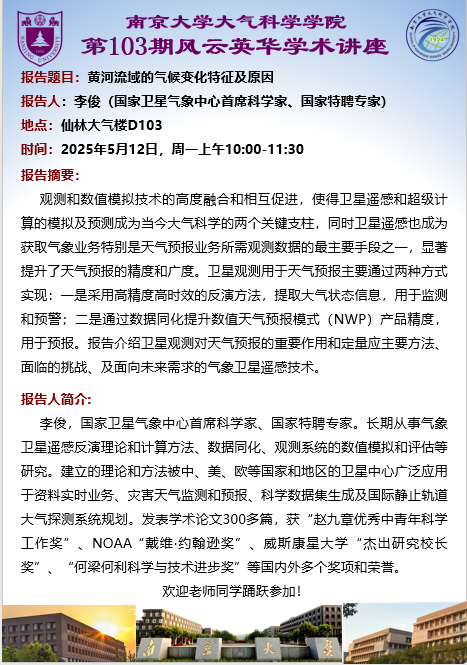
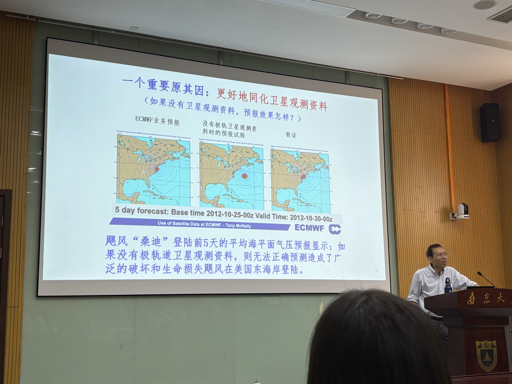
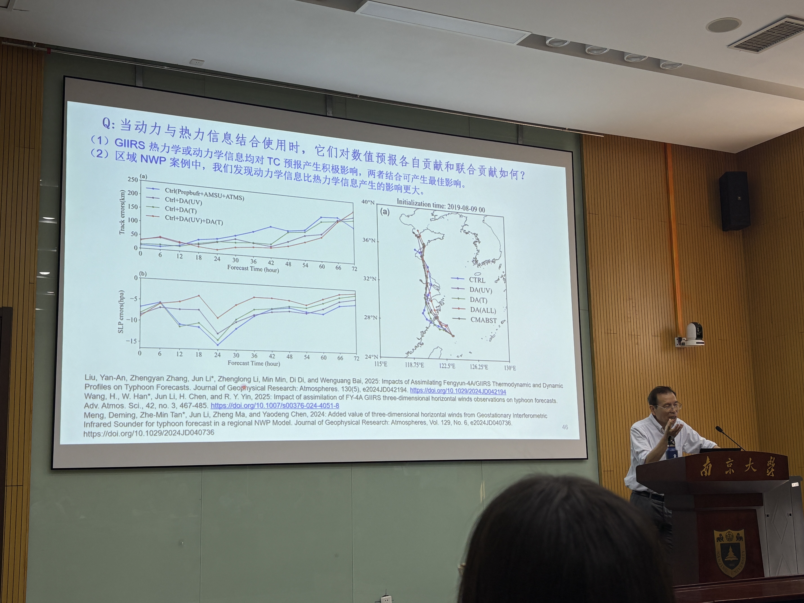
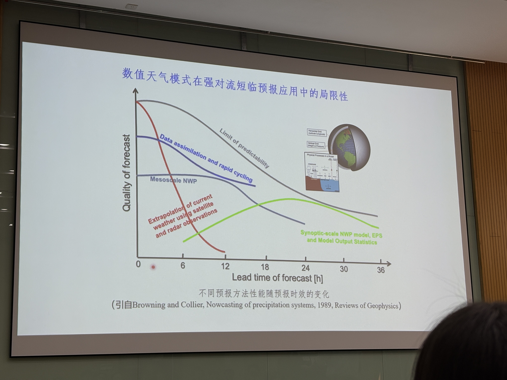
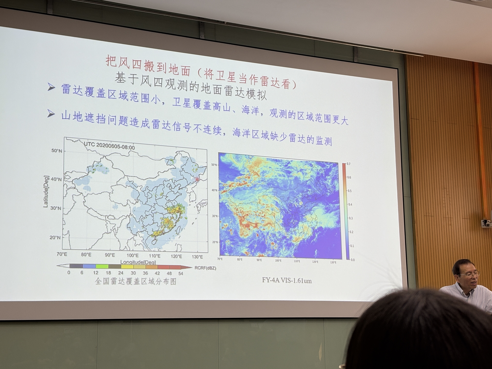
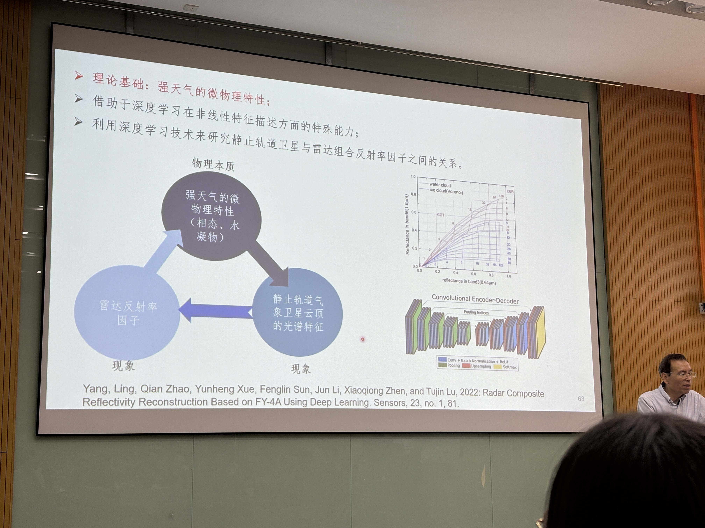
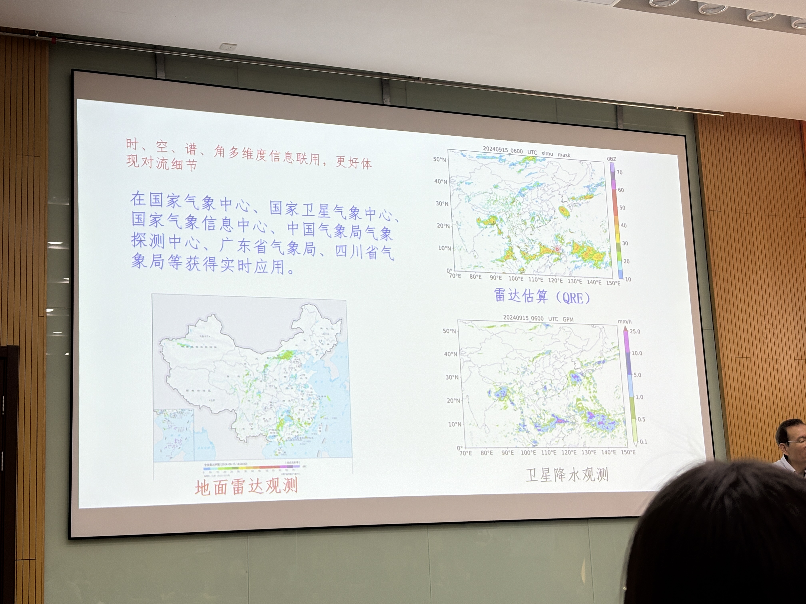
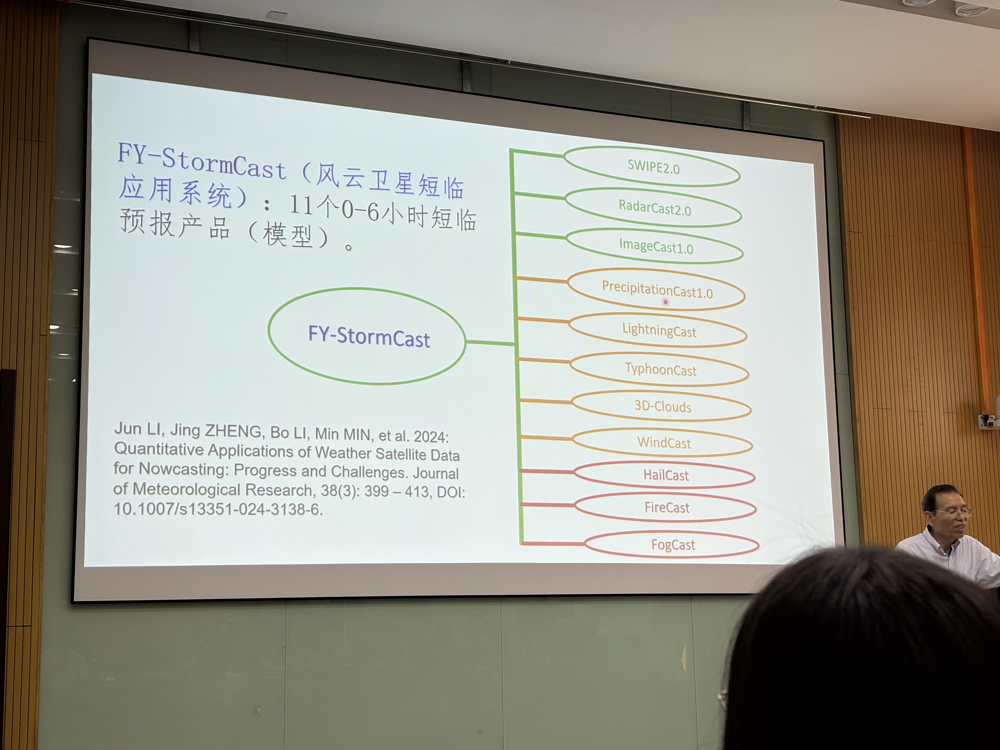
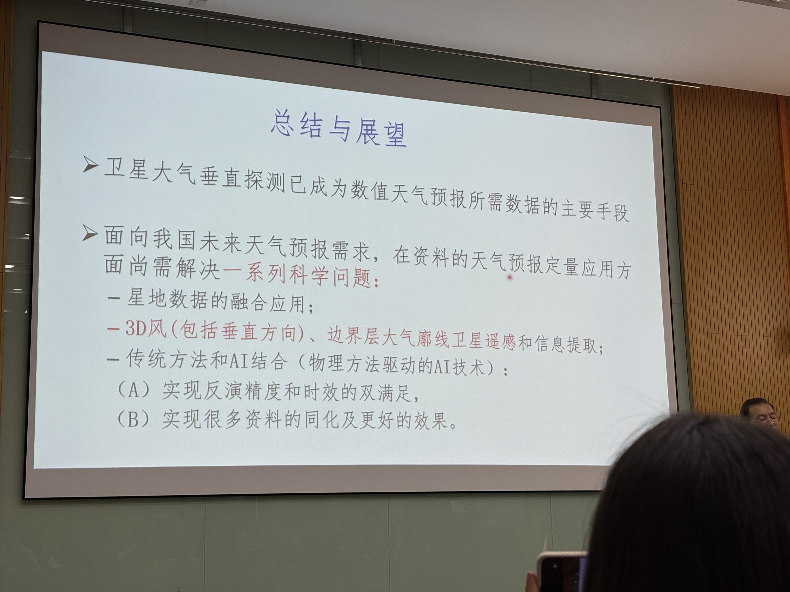

# 1 Background
verner suomi, WCU, 气象卫星之父

# 2.大气垂直廓线探测
William L.Smith ITTP-IAPP-IMAPP-CSPP 软件包 
Linear simulataneous solution for tempertature and absorbing ...  Li et al., 1994

# 3.数值天气预报与同化
Q1 同化的重要意义：提高预报准确率与时效性

Q2 云区红外观测的难题
飓风预报：天气敏感区，增加资料进入同化，使得预报结果有了很大改善 
晴空资料不够，还是需要突破云区难题，增加资料。
Q 热、动力结合使用的效果

# 4.短临预报难题

 
 
 
 

# 5.总结
